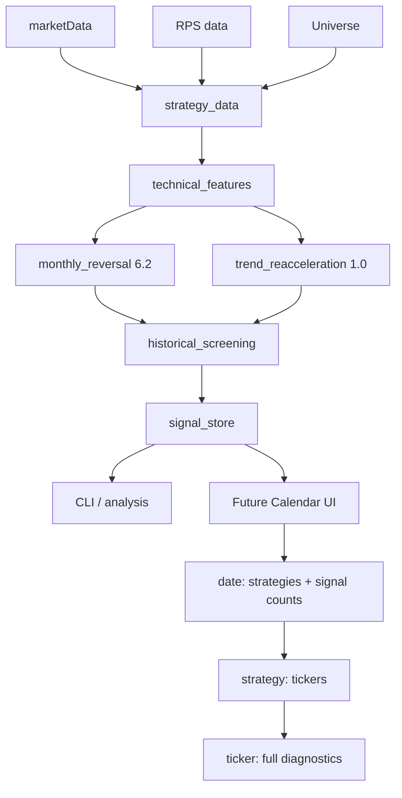

# Historical Signals 设计 — Source of Truth

本文是 Historical Screening Engine 和 Historical Signal Store 的长期架构约定。
实现与后续变更应同步维护本文。当前交付范围为 Phase 1。

## 系统定位和数据语义

Signal Store 是 **derived materialized cache / derived dataset**，不是市场事实的
source of truth。真正的输入事实与定义是 price data、RPS definition/data、Universe、
strategy implementation 和 strategy configuration。删除整个 store 后，使用相同输入
重新运行应得到相同 signal 和 diagnostics；生成时间自然可以不同。

本系统执行 Historical Signal Replay / Historical Screening：重新评价历史交易日，
保存匹配股票及诊断。它不模拟 entry/exit、仓位大小、组合、交易成本、P&L、CAGR、
Sharpe、组合最大回撤或基准表现。未来真正回测应放入独立 `backtest.py` 或对应模块。
策略自有的 drawdown diagnostic 仍保留，不能与组合绩效最大回撤混为一谈。

统一 `data_mode = retrospective_latest_data`：使用当前可获得的历史价格、adjusted
OHLC、RPS 和当前 Universe 重新评价过去。这不是严格 point-in-time backtest：Yahoo
复权历史可能被 corporate action 修订；当前 Universe 不一定是历史每日 Universe；
项目未保存每日历史 Universe snapshot。Phase 1 不实现历史 Universe 或 Yahoo 快照系统。
指标本身仍必须 backward-looking，不允许 batch 计算使用评价日之后的信息。

## 长期架构



`historical_screening` 和 `daily_screening_notification` 是不同 orchestration layer。
历史运行不导入通知入口、不发送邮件、不调用 SMTP，也不自动接入每日 Action。
price/RPS 持久化 schema 和现有策略公式保持不变。

## Phase 1 的运行合约

`run_historical_screening(start_date, end_date=None, *, strategies=None,
output_store=None, force=False, ...)` 支持任意自然日闭区间及单策略/多策略选择。
`None` store 使用 `data/signals/`，不是关闭持久化。`end_date=None` 或 CLI 的
`--end-date latest` 表示 price manifest 的最新交易日。

1. 读取已验证的 price manifest 和当前 Universe。
2. 将开始日期向后对齐到 XNYS session，同时限制在数据实际起始日期之后；结束日期
   向前对齐，并截断到 price dataset latest session。周末、节假日不产生输出。
   反向区间或截断后无交易日抛出清晰的 `HistoricalScreeningError`，不写 coverage。
3. 自动解析 warmup，经 `strategy_data.load_strategy_price_history` 一次加载完整
   Universe 所需年度分区。沿用首年额外行的保留规则；不重复读逐日分区。
4. 一次调用 `load_or_calculate_rps`，共享所选策略需要的 lookbacks（两策略为
   50/120/250）。持久化 RPS 优先，缺失时复用已加载的完整 Universe 价格回退计算。
   历史引擎不写回 price/RPS store。
5. 按 ticker 计算每个所选策略的完整 feature history，一次计算后截取目标 sessions，
   仅收集 `signal=True`。禁止逐日调用现有 `screen_*` 或逐 ticker 调用存储 history API。
6. 全部计算成功后，验证结果与 coverage，安全替换请求 sessions。

简单 `SUPPORTED_STRATEGIES` registry 管理 id、版本、lookbacks、warmup、配置和
feature callable。新增策略应扩展 registry，不建立复杂插件框架。
Monthly Reversal 固定公式版本为 6.2；Trend Re-acceleration 版本为现有 `STRATEGY_VERSION`
1.0，允许传入现有 `TrendReaccelerationConfig`。

### Warmup 和缺失数据

Monthly Reversal 的特征 warmup 为 250 个 ticker rows，signal 还需要前 14 个 ticker
rows 已可评价，即至少 264 行。引擎在目标区间之前准备 RPS/YXFZ 历史，再运行原有
signal 函数，不能把 requested_start 当成特征历史起点。存在缺失 ticker sessions 时，
RPS 预备范围也应覆盖实际前 14 行，而不只假设它们恰好等于 14 个市场 sessions。

Trend Re-acceleration 默认要求 `250 + 30 - 1 = 279` 行；自定义配置使用现有
`required_price_rows`。价格加载沿用至少 320 session 的缓冲，必要时按配置增加。
不足历史或个股当日无价格时继续遵循现有策略排除规则，不填充、不制造信号。
若目标某个市场 session 完全没有价格输入，运行报错，不将缺失市场数据标为零匹配。

Trend Re-acceleration 的 `signal = setup` 原样保留；连续三天符合就保存三条。
Monthly Reversal 原有前 14 行首次出现/抑制语义原样保留。

## Store 布局、schema 和写入

默认布局：

```text
data/signals/
    coverage.parquet
    monthly_reversal/
        2025.parquet
        2026.parquet
    trend_reacceleration/
        2025.parquet
        2026.parquet
```

文件采用现有 PyArrow/Parquet、ZSTD 和确定性排序约定。公共字段有固定 Arrow 类型；
每个策略保留自己的普通列 diagnostics，不把所有 diagnostics 压成 JSON。
Parquet metadata 标记 store schema version。无匹配也可产生有 schema 的空年度分区。

| 公共 metadata | 类型/含义 |
| --- | --- |
| session | date32，评价交易日 |
| strategy_id / strategy_version | string，所运行的策略及公式版本 |
| generated_at | UTC timestamp，运行生成时间 |
| config_hash | nullable string，规范配置 JSON 的 SHA-256 |
| config_json | string，实际使用的规范配置；Monthly Reversal 为固定公式配置 `{}` |
| universe_hash | nullable string，复用现有 canonical Universe hash |
| input_fingerprint | nullable string，Phase 1 为 null，不用于缓存复用 |
| data_mode | string，`retrospective_latest_data` |

Signal rows 还包含 ticker 和当前 feature function 的全部诊断列，将 `date` 统一命名
为 `session`。包括 adjusted OHLC、MA、rolling 结果、所有 FYX/YXFZ 或动量/趋势/回撤/
重新转强布尔项、signal、readiness/status。不存 signal=False 的全市场明细。

Coverage 包含公共 metadata，以及 `status=complete`、非负整数 `signal_count`。
`complete` 表示完整执行了该 session/strategy 的筛选，不表示每只股票都有足够历史。
成功执行但零匹配必须有 complete/0；不存在 coverage 表示尚未计算，不能解释为零。
Phase 1 不持久化 failed 状态：计算或写入失败不发布新 complete coverage。

逻辑键为 coverage `(session, strategy_id, strategy_version)` 和 signal
`(session, strategy_id, strategy_version, ticker)`。Phase 1 每个 session/strategy
只保留一个当前版本；重新运行该 session 时旧版本/旧配置也被替换，避免 UI 默认查询
产生歧义。替换范围之外的日期、年份及未选中的策略保持原样。版本归档不是本阶段目标。

### 幂等、安全替换

`replace_signal_range(signals_by_strategy, coverage, *, root=...)` 以 coverage 中的
精确 session/strategy 集合作为替换范围：先删除这些 sessions 的旧 matches，再加入
新 matches。因此 True→False 会移除旧记录，零匹配不会留下过期股票。
重跑不会产生重复键；generated_at 更新是预期行为。

一次 run 先完成全部计算，再在同文件系统临时目录写所有受影响年度分区及 coverage；
检查键、schema、元数据、signal=True 和 counts 一致性。复用
`storage_manifest.replace_files_transactionally`，按 results → coverage 顺序替换，
校验失败恢复旧文件。只重写受影响的 strategy/year 和较小的 coverage 索引。
写入期间设置未完成标记，读取 API 拒绝未完成替换；异常回滚验证通过后清除标记。
如果进程被强制中断留下标记，store fail closed，需要恢复或从源输入重建；不能直接
把残留 coverage 当作新结果。Phase 1 为本地单 writer 模型，未来 UI 并发快照读取及
自动 crash recovery 应独立完善，不宣称多个文件在操作系统层面具有单一原子提交。

## 稳定读取 API 与 UI

`signal_store` 不执行策略公式、技术指标或 RPS。

```python
get_signal_calendar(start_date, end_date, *, strategy_id=None, root=...)
get_signals_for_date(session, *, strategy_id=None, root=...)
get_signal_detail(session, strategy_id, ticker, *, root=...)
read_strategy_signals(strategy_id, start_date=None, end_date=None, *, root=...)
```

Calendar 返回 coverage（含零匹配日期）；date query 返回所有/指定策略匹配项的公共
metadata 和 ticker；detail 返回单条 Series，含该策略全部 diagnostics，未找到返回
None。`read_strategy_signals` 提供单策略区间完整明细用于分析。未知/未计算日期返回
空结果；损坏文件或未完成替换明确报错，不能伪装成无信号。

未来 UI 只查询 store：Calendar → date/各策略计数 → strategy/tickers → ticker/
diagnostics。UI 不应调用 `screen_monthly_reversal(date)` 或实时重算任何策略。

## 缓存与后续阶段

Phase 1 默认 **recompute + replace requested interval**，即使已有 coverage 也重算。
`force=True` 当前只是显式表达相同行为，不改变结果；不得因文件存在就跳过。

Phase 2 的复用原则为：existing result + unchanged input fingerprint = reuse；
fingerprint changed = recompute。依赖可能包括 strategy id/version、配置、实现代码、
Universe、相关价格及相关 RPS。**不能用整个 marketData 的 global hash 作为所有
历史日期唯一失效条件**：新增未来 session 不应让全部过去日期重算。
`Signal(t)` 的 temporal dependency 只能涉及 `data <= t`；后续 corporate action
修订可能改变相关历史输入，需要识别受影响的实际窗口。当前不实现依赖 DAG，预留
metadata 字段和 force/API 入口，不以任何 Phase 1 hash 自动判定有效缓存。

| 阶段 | 范围 |
| --- | --- |
| Phase 1 — 当前 | 任意日期区间、批量历史筛选、signal persistence、coverage、query APIs、CLI、完整 diagnostics、安全 replace |
| Phase 2 — Future | cache reuse、精确 input fingerprint、price/RPS dependency invalidation、自动增量历史更新 |
| Possible Phase 3 — Future | Calendar UI、charts、signal detail UI |
| Separate future project | 真正 point-in-time backtesting、组合模拟、策略绩效 |

Phase 1 不新增数据库、并行计算框架、前端、通知、Release 类型或自动每日任务。
运行数据加入 `.gitignore`；未来是否发布 Signal Store 到 GitHub Release 另行设计。

## CLI 与验收

```bash
uv run python -m momentum_screener.historical_screening \
  --start-date 2026-08-01 --end-date latest

uv run python -m momentum_screener.historical_screening \
  --start-date 2024-06-01 --end-date 2025-03-31 \
  --strategy monthly_reversal --strategy trend_reacceleration \
  --output-store /tmp/historical-signals --force
```

CLI 只打印 requested/actual 区间、session 数、各策略信号数和 store 路径，不打印完整
股票列表。通过 `--prices-root`、`--rps-root`、`--universe` 选择现有输入。
测试覆盖日期边界/空区间、batch 对齐既有策略、warmup、重复信号、零结果 coverage、
幂等/变更替换、各读取 API、无前视性、删除重建、写入失败回滚。真实验收只需短区间，
不要求跑完整 2016→2026 历史。
